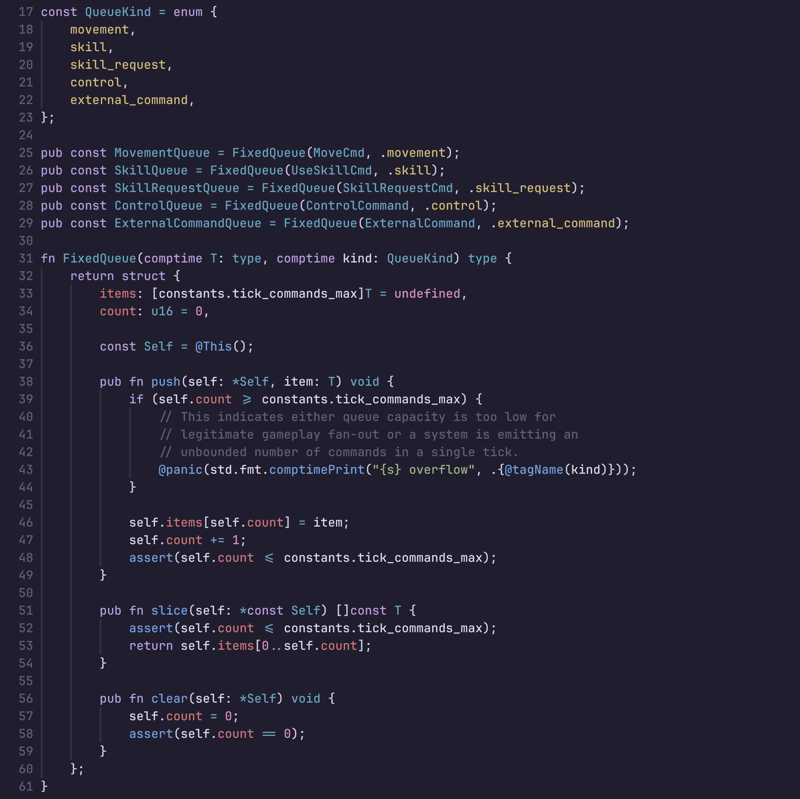

# Flume

A wavy theme inspired by One Dark, Duskfox and Kanagawa.



## Setup & Installation

### 1. Ghostty Config

Copy or symlink `ghostty/flume` into your Ghostty themes folder:

```bash
ln -sf ~/dotfiles/themes/flume/ghostty/flume ~/.config/ghostty/themes/flume
```

Then, select it in your `ghostty/config`:

```ini
theme = flume
```

### 2. Neovim Plugin Setup

If using `lazy.nvim`, load the plugin from your local submodule path:

```lua
return {
    dir = vim.fn.expand("~/dotfiles/themes/flume"),
    name = "flume.nvim",
    lazy = false,
    priority = 1000,
    config = function()
        require("flume").setup()
    end,
}
```

Run `:FlumeReload` to instantly hot-reload the highlights without restarting

### 3. Tmux Configuration

Add the following line to your `~/.tmux.conf` to dynamically load the styles on startup or reload:

```tmux
run-shell "~/dotfiles/themes/flume/tmux/apply.sh"
```
